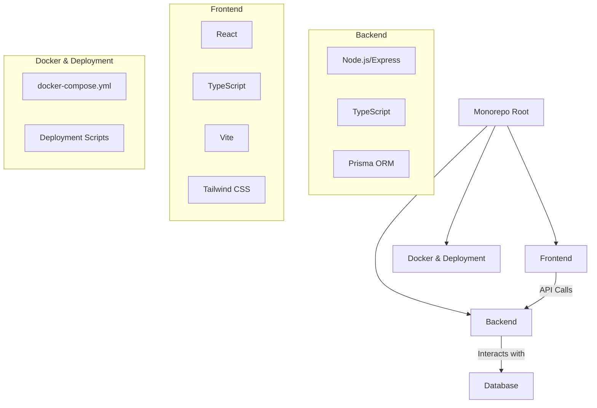

This project is a **monorepo**, which means it houses more than one sub-project within a single repository. It's structured as a classic client-server application with a distinct frontend and backend.

### Core Components

1.  **`backend/`**: This directory contains the server-side application.
    *   **Technology**: It's a [Node.js](https://nodejs.org/) application written in [TypeScript](https://www.typescriptlang.org/).
    *   **API**: It uses the [Express.js](https://expressjs.com/) framework to create a REST API. The API routes are defined in `backend/src/routes/`.
    *   **Database**: It uses [Prisma](https://www.prisma.io/) as an ORM (Object-Relational Mapper) to communicate with a database. The database schema is defined in the `backend/prisma/schema.prisma` file.
    *   **Entry Point**: The application server is started from `backend/src/index.ts`.

2.  **`frontend/`**: This directory contains the client-side application that runs in the user's browser.
    *   **Technology**: It's a single-page application (SPA) built with [React](https://react.dev/) and [TypeScript](https://www.typescriptlang.org/).
    *   **Build Tool**: It uses [Vite](https://vitejs.dev/) for a fast development experience and for bundling the application for production.
    *   **Styling**: [Tailwind CSS](https://tailwindcss.com/) is used for styling the components.
    *   **Components**: The user interface is built from a set of reusable components found in `frontend/src/components/`.
    *   **Entry Point**: The React application is initialized in `frontend/src/main.tsx`.

3.  **Root Directory (`/`)**:
    *   **Orchestration**: The `docker-compose.yml` file is key. It defines how to build and run both the frontend and backend services together in Docker containers, making local development setup straightforward.
    *   **Deployment**: Scripts like `one-click-deploy.sh` and `vps-setup.sh` suggest an automated process for deploying the application to a server.
    *   **Data**: The `.pbn` file (`1011_Zitting 1 [17-Jun].pbn`) is a Portable Bridge Notation file, indicating it's used as seed data for the application's bridge-related features.

### How It Works

The frontend and backend are separate applications that communicate over a network (even when running on the same machine). The frontend makes API requests to the backend to fetch or modify data, and the backend responds with the necessary information after interacting with the database. This separation of concerns is a very common and robust architecture for modern web applications.